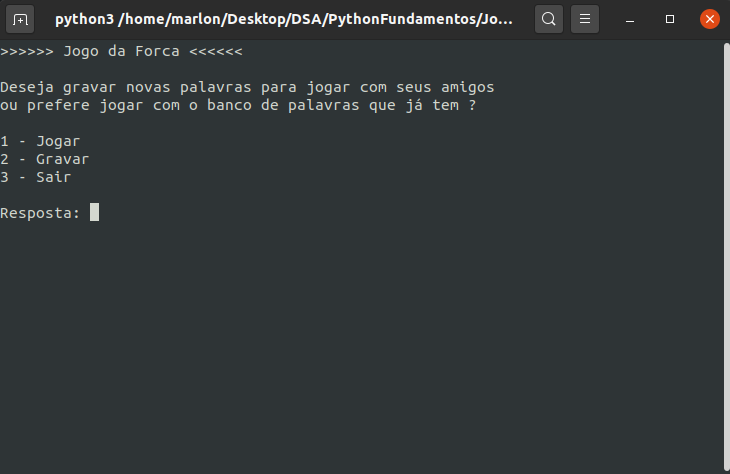
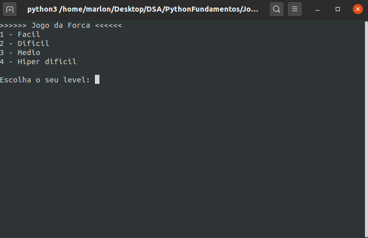
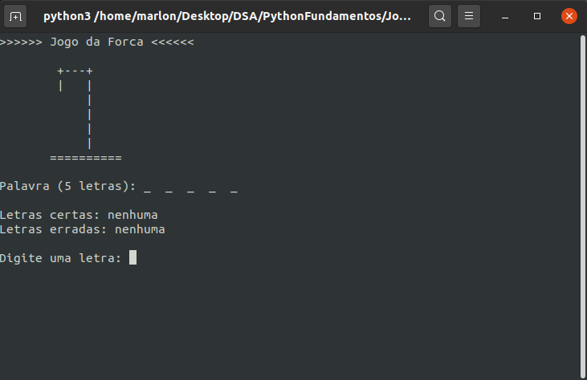
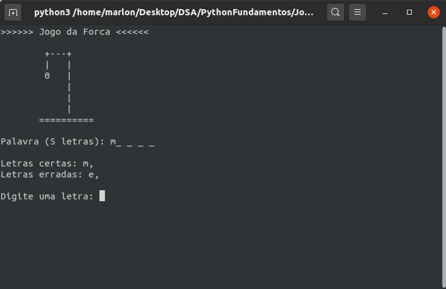
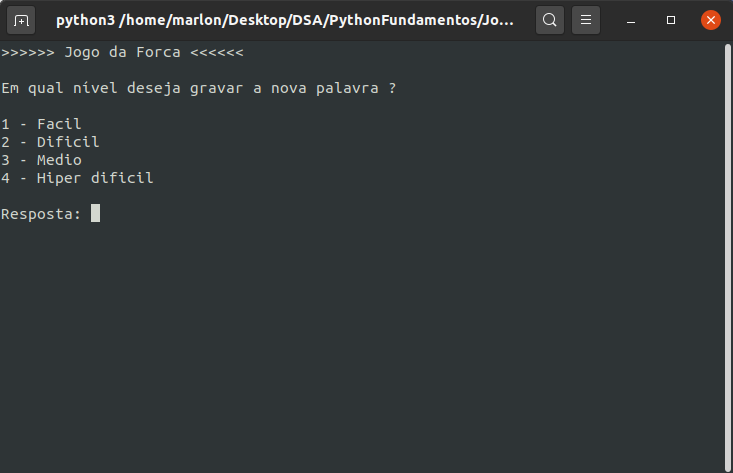
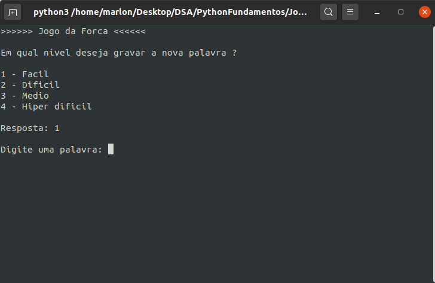
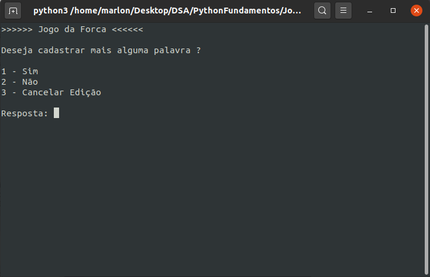
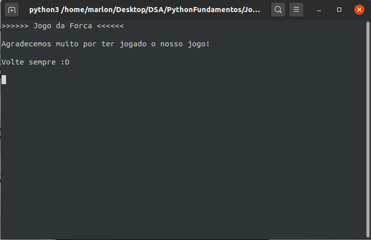
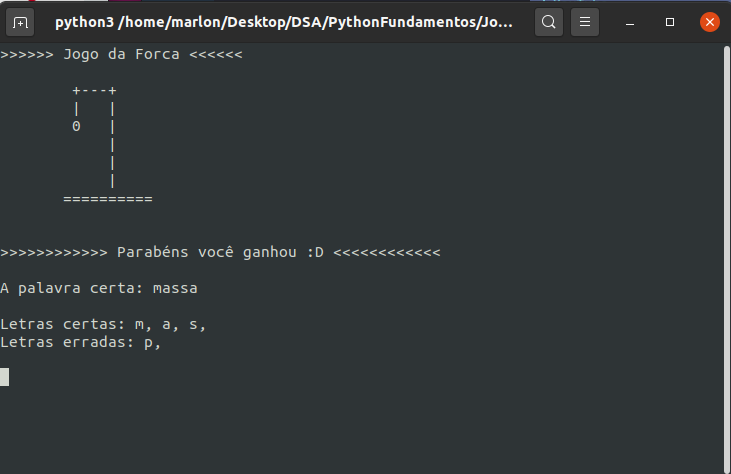
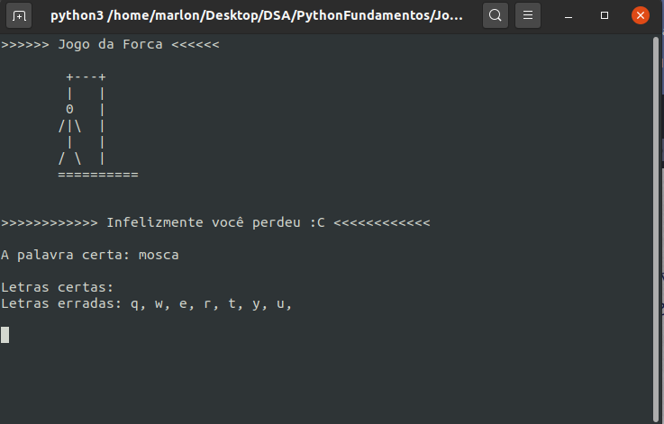

# Jogo_da_forca-Marlon

Esse projeto foi totalmente desenvolvido em Python, e feito para o terminal do seu sistema, mais conhecido como **cmd** ou **prompt de comando**, ou ainda como **terminal**.

## **Intuito**

O intuito do projeto foi para exercitar os 5 primeiros módulos do curso 
**[Python Fundamentos para Análise de Dados](https://www.datascienceacademy.com.br/course?courseid=python-fundamentos)**
que é um curso totalmente gratuito disponibilizado pela **[Data Science Academy](https://www.datascienceacademy.com.br/)**

---
## **Explicação do Projeto**

- O projeto em sí é um jogo, que se chama Jogo da Forca, a sua origem segundo o site [ITW Grupo 15](http://web.ist.utl.pt/ist172902/Hangman/history.html) é obscura,
mas acredita-se que foi criado na Inglaterra Victoriana.
Segundo Tony Augarde, autor de O Guia de Oxford para jogos de palavra, o primeiro registro do jogo foi feito no livro Traditional Games publicado em 1894. 
O jogo é também mencionado por Alice Bertha Gomme no seu livro Jogos Tradicionais em 1894 sob o nome de "Pássaros, animais e peixes". Também aparece com outras designações como “Forca” e “Enforcador.”

---
## **Regras**

- O jogo da forca é um jogo bem simples, o objetivo é acertar a palavra secreta selecionada.

#### *Como jogar*

- Primeiramente é selecionado uma palavra do banco de dados, ou se for feito em um papel da maneira tradicional,
um dos participantes escolhe uma palavra, que será designada como *palavra secreta*, que será a palavra que o outro jogador
terá que descobrir.

- Após ser selecionado a palavra, quem o selecionou diz quantas letras tem a palavra, e até desenha no papel com um **[ - ]** para cada letra, por exemplo:
  
   - Palavra secreta: *BANANA* ficaria assim:  **- - - - - -**

- Após tudo arrumado, palavra selecionada, é então começado o jogo. A pessoa que está jogando terá que ir dizendo letras que acha que terá
na palavra secreta, assim se acertar a letra, ela será demarcada onde ela está na palavra, por exemplo:
  - Palavra secreta: *BANANA* ficaria assim:  **- - - - - -**
  &nbsp;
   
    **Letra certa**: **a** ficaria assim: **- A - A - A**
    
- Se a letra estiver errada, é feito um desenho no papel indicando uma das partes do personagem, ficando assim:
   - 
  
- Se a pessoa errar todas as letras, o personagem ficará igual a imagem a cima.

---
## **Codificação**

Para realização da codificação do jogo, foi utilizado *OOP* (Programação Orientada a Objetos), designando
tarefas para classes diferentes, separado assim as funções, para que o código ficasse o mais legível e entendível possível.
&nbsp;

Para isso foi necessário a criação de 4 classes:
- Classe Game: Ela é a classe onde está rodando o jogo, onde tem o looping principal, e onde é feito as chamadas a objetos que necessitaram no jogo.

- Classe Forca: Ela é a classe onde está cada forca desenhada, para assim ser renderizada quando o jogador errar alguma letra:

- Classe Telas: Ela é a classe que contem as telas do jogo, como tela inicial onde terá as opções do jogo, como gravar novas palavras, iniciar jogo , e a opção de sair. Também possui as telas de quando o jogador ganhar ou perder.

- Classe Palavras: Nessa classe é feito o carregamento e seleção da palavra secreta.

----
## **Prints do Jogo**

**Tela Inicial**
- Na tela inicial tem as opções de jogar, gravar, onde o jogador irá gravar novas palavras nos arquivos, e a opção des sair.
&nbsp;

**Tela Jogar - Seleção de Níveis**
- Na tela de jogar, o jogador primeiramente irá selecionar o nível, e assim o script irá carregar o arquivo desse nível, selecionando as palavras dentro dele.
&nbsp;

**Tela Jogar - Jogando**
- Após a seleção do nível das palavras, agora aparecerá a tela com a forca, mostrando quanto o jogador acertou ou errou, e aparecendo a palavra secreta, também com a quantidade de letras que acertou e errou.
&nbsp;

**Tela Jogar - Erro - Acerto**
- Nessa tela mostra como fica após o jogador acertar uma letra, e errar uma letra, pode-se ver que ao acertar a letra, aparece ali em Palavra, onde está a letra.
&nbsp;

**Tela Gravar - Seleção de Níveis**
- Ao selecionar a opção de gravar, o jogador entre nessa tela, que agora está pedindo para selecionar o nível da palavra que deseja gravar.
&nbsp;

**Tela Gravar - Digitando Palavra**
- Aqui está pedindo para digitar uma palavra para ser gravada.
&nbsp;

**Tela Gravar - Gravando Palavra**
- Logo após digitar a palavra e dar enter, aparece essa tela para confirmação, se quer cadastrar mais, ou se quer cancelar a edição, assim como a opção de não gravar mais e ir para a tela de jogar..
&nbsp;

**Tela Sair - Sair**
- Ao selecionar a opção sair, vem para essa tela.
&nbsp;

**Tela Ganhar**
- Aqui é quando o jogador consegue acertar a palavra. Ao final é mostrado quantos erros e acertos teve, e também a palavra que ele acertou.
&nbsp;

**Tela Perder**
- Aqui é quando o jogador perde. Ao final é mostrado quantos erros e acertos teve, e também a palavra que ele acertou.
&nbsp;

---
*Observações:*
O projeto foi feito utilizando o python 3.7, e limpeza de terminal feito para linux, por isso se você testar no windows, funcionará normalmente, mas as telas não serão limpas a cada atualização.
---
**Agradeço por terem acompanhado o post todo e a explicação, e trarei mais projetos.**